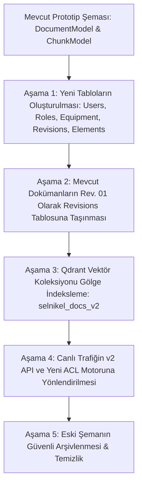

# Selnikel AI — Geçiş ve Veritabanı Migrasyon Planı (MIGRATION_PLAN.md)

> **Geçiş İlkesi**: Sıfır Kesinti (Zero-Downtime), Geri Alınabilir (Reversible) Şema Değişiklikleri, İki Aşamalı Veri Taşınması (Shadow Indexing).

---

## 1. Geçiş Aşamaları Genel Bakışı

---

## 2. Alembic Veritabanı Migrasyon Sırası

### Migrasyon 1: `001_enterprise_core_tables.py`
- `users`, `roles`, `permissions`, `equipment` ve `audit_events` tablolarını oluşturur.
- Varsayılan departmanları (`Ar-Ge`, `İmalat`, `Kalite`, `Servis`) ve varsayılan `admin` rolünü ekler.

### Migrasyon 2: `002_revisions_and_elements.py`
- `document_revisions`, `document_elements`, `ingestion_jobs` ve `service_cases` tablolarını oluşturur.
- Mevcut `documents` tablosuna `current_revision_id`, `classification`, `deleted_at` sütunlarını ekler.

### Migrasyon 3: `003_backfill_existing_documents.py`
- Mevcut `documents` kayıtları için birer `document_revisions` kaydı (`revision_code='Rev. 01'`, `approval_status='approved'`) üretir ve `current_revision_id` alanını günceller.
- Mevcut `document_chunks` verilerini hiyerarşik `document_elements` yapısına dönüştürür.

---

## 3. Qdrant Vektör Koleksiyonu Geçişi (Shadow Indexing)

1. **Yeni Koleksiyon Açılışı**: `selnikel_docs_v2` koleksiyonu 1024 boyutlu kosinüs mesafesi ve BM25 sparse vektör alanı ile oluşturulur.
2. **Yük (Payload) Zenginleştirme**: Her vektör noktasına zorunlu alanlar eklenir:
   - `department_id: string`
   - `revision_id: string`
   - `approval_status: string`
   - `equipment_ids: string[]`
   - `classification: string`
3. **Canlı Doğrulama**: `v1` ve `v2` koleksiyonlarına paralel sorgu atılarak Recall ve skor tutarlılığı doğrulanır.
4. **Alias Değişimi**: `selnikel_docs_active` alias'ı `selnikel_docs_v2` koleksiyonuna yönlendirilir.

---

## 4. Geri Alma (Rollback) Stratejisi

Eğer migrasyon veya canlı testler esnasında kritik bir hata meydana gelirse:
- **Veritabanı Rollback**: `alembic downgrade -1` ile geriye dönülür.
- **Qdrant Rollback**: Alias tekrar `selnikel_docs_v1` koleksiyonuna çekilir.
- **API Fallback**: API Gateway üzerinden v1 eski endpoint'leri aktif tutulur.
