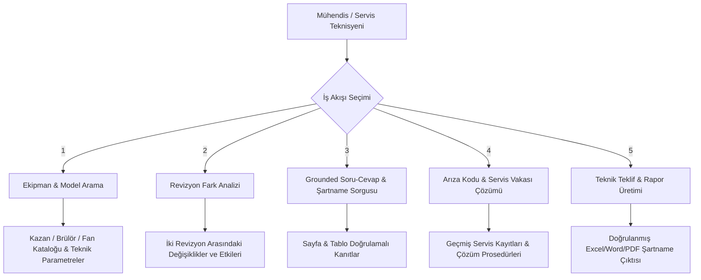

# Selnikel AI — Ürün Kapsamı & Sınırları (PRODUCT_SCOPE.md)

> **Ürün Tezi**:  
> “Selnikel’in kazan, brülör, fan, basınçlı kap, bakım ve servis dokümanlarını; ekipman, model, revizyon, standart ve departman bağlamında anlayan, her teknik cevabı doğrulanabilir kaynaklara bağlayan kurumsal mühendislik bilgi sistemi.”

---

## 1. Ürün Kimliği ve Temel İlkeler

Selnikel AI, genel amaçlı bir sohbet botu veya genel web arama aracı değildir. Selnikel Enerji A.Ş.'nin 70+ yıllık endüstriyel imalat, Ar-Ge ve saha servis tecrübesini dijitalleştiren, **belge revizyonu güvenli, teknik hesaplama doğrulamalı ve kurumsal erişim denetimli** bir Karar Destek İstasyonudur.

### Temel Kurallar
1. **Asla Uydurma (No Hallucination Tolerance)**: Sağlanan dokümanlarda kesin kanıt yoksa sistem tahminde bulunmaz, net bir dille cevabı reddeder (`abstained: true`).
2. **Revizyon Bilinci (Revision-Awareness)**: Bir ekipmanın güncel ve eski şartnameleri arasındaki farklar açıkça gösterilir. Yürürlükten kalkan revizyonlar açıkça işaretlenir.
3. **Sayfa ve Tablo Seviyesinde Kanıt (Grounded Provenance)**: Her cevap, dokümanın tam adı, sayfa numarası, tablo başlığı veya prosedür adımına doğrudan tıklanabilir bağlantılarla referans verir.
4. **Onaylı vs. AI Taslağı Ayrımı**: Başmühendis veya yetkili mühendis tarafından onaylanmış resmi cevaplar ile LLM tarafından üretilen taslak yanıtlar görsel ve mantıksal olarak birbirinden ayrılır.

---

## 2. Birincil Kullanıcı İş Akışları (In-Scope Workflows)

### Detaylı İş Akışları:
1. **Ekipman veya Model Koduna Göre Teknik Bilgi Bulma**:
   - Model koduna göre (örn: `SB-100`, `GLS-35`, `Radyal Fan 600mm`) tüm ilişkili montaj kılavuzlarını, P&ID şemalarını, test föylerini ve çalışma sınırlarını listeleme.
2. **Güncel ve Eski Belge Revizyonlarını Ayırt Etme**:
   - Bir dokümanın en güncel onaylı revizyonunu (`approval_status: approved`, `effective_at`) tespit etme.
3. **İki Revizyon Arasındaki Değişiklikleri Gösterme (Diff Engine)**:
   - Revizyon A ile Revizyon B arasındaki parametre, tolerans ve montaj kuralı değişikliklerini yan yana tablo halinde listeleme.
4. **Teknik Sorulara Sayfa, Tablo ve Bölüm Kaynaklı Cevap Verme**:
   - Hesaplama formülleri ve işletme limitleri için tam doküman konumu (`[SB-100 Şartnamesi, S.14, Tablo 3.2]`) sunma.
5. **Kaynak Yetersizse Cevap Vermeyi Reddetme (Refusal Policy)**:
   - Eğer bilgi arşivdeki kaynaklarda mevcut değilse uydurma yapmadan *"Mevcut teknik dokümanlarda bu parametreye dair doğrulanmış bilgi bulunamadı"* yanıtı verme.
6. **Arıza Kodu ve Servis Vakası Arama**:
   - Brülör arıza kodları (örn: `E04 Alev Hatası`), kazan kireçlenme/basınç anomalileri ve fan balans titreşim semptomları için geçmiş servis vakalarını ve üretici çözüm adımlarını bulma.
7. **Bakım Prosedürü Bulma**:
   - Emniyet ventili yıllık testi, brülör nozul temizliği ve fan rulman yağlama periyotlarını adım adım listeleme.
8. **Teknik Teklif İçin Doğrulanmış Veri Çıkarma**:
   - Müşteri şartnamesine uygun kazan kapasitesi, brülör uyumluluğu ve fan debi gereksinimlerini otomatik derleme.
9. **Benzer Ekipman ve Geçmiş Vaka Bulma**:
   - Vektörel semantik benzerlik ile daha önce benzer arıza yaşamış kazan/brülör montajlarını getirme.
10. **Onaylı Cevap ve Taslak AI Cevabını Ayırma**:
    - Başmühendis onayı (`approved_by`, `approved_at`) taşıyan yanıtlar yeşil damgalı; AI üretimi taslaklar gri damgalı sunulur.
11. **Kim, Hangi Belgeye, Ne Zaman Erişti Denetimi (Audit Log)**:
    - Tüm arama, görüntüleme, soru sorma ve dışa aktarma işlemleri `AuditEvent` tablosunda denetlenebilir şekilde saklanır.

---

## 3. Ürün Dışı Bırakılan Unsurlar (Out-of-Scope)

Aşağıdaki özellikler, kurumsal güvenilirlik ve endüstriyel odak gereği **ilk üretim sürümüne kadar durdurulmuş veya arayüzden kaldırılmıştır**:

- ❌ **Videolu Özet (Video Briefings)**
- ❌ **Slayt Üretimi (PowerPoint Presentations)**
- ❌ **Sesli Özet (Audio Overviews / Podcasts)**
- ❌ **Bilgi Kartları (Flashcards)**
- ❌ **Genel Amaçlı Test & Quiz Üretimi**
- ❌ **Filigran, Abonelik Planları ve PRO Rozetleri**
- ❌ **Discord / Harici Sosyal Medya Bağlantıları**
- ❌ **Google, Gemini ve NotebookLM Marka Dili veya Logoları**
- ❌ **Gerçek Olmayan veya Yalnızca `alert()` Gösteren Sahte Aksiyonlar**

---

## 4. Ekipman ve Belge Taksonomisi

### Ekipman Türleri (`equipment_type`):
- `boiler`: Buhar Kazanı, Kızgın Yağ Kazanı, Sıcak Su Kazanı
- `burner`: Endüstriyel Monoblok / Duoblok Gaz, Fuel-Oil, Çift Yakıtlı Brülörler
- `fan`: Radyal Fan, Aksiyal Fan, Yüksek Basınçlı Endüstriyel Fanlar
- `pressure_vessel`: Basınçlı Kaplar, Degazörler, Eşanjörler, Kollektörler
- `other`: Yardımcı Ekipman ve Otomasyon Panoları

### Belge Türleri (`document_type`):
- `technical_specification`: Teknik Şartname
- `manual`: Kullanım ve Montaj Kılavuzu
- `datasheet`: Ürün ve Performans Bilgi Formu
- `service_record`: Saha Servis Raporu ve Bakım Föyü
- `standard`: İmalat Standardı (EN 12953, ASME, CE, ISO)
- `drawing`: P&ID ve Teknik Çizim

---

## 5. Üretim Kabul Kriterleri (Production Gates)

1. **Sıfır İllüzyon Garantisi**: RAG cevaplarının %100'ü geri izlenebilir doküman parçalarına (`evidence`) sahip olmalı.
2. **Katı ACL İzolasyonu**: İmalat departmanı kullanıcısı, Ar-Ge gizli patent dokümanını aramalarda ve RAG cevaplarında asla görememeli.
3. **Revizyon Güvenliği**: Arama sonuçlarında güncel olmayan bir doküman yer aldığında sarı renkle *"Rev. 01 - Bu doküman yürürlükten kalkmıştır (Güncel: Rev. 03)"* uyarısı verilmeli.
4. **E2E Denetim İzi**: Her RAG sorgusu ve doküman indirmesi veritabanında `actor_id`, `resource_id` ve `request_id` ile kalıcı olarak loglanmalıdır.
