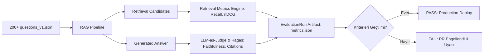

# Selnikel AI — RAG Kalite & Değerlendirme Planı (RAG_EVALUATION_PLAN.md)

> **Kalite İlkesi**: Pazarlama iddiaları ("%100 doğruluk", "sıfır halüsinasyon") yerine istatistiksel güven aralıkları, 200+ gerçek mühendislik vakası ve katı güvenlik sınırları.

---

## 1. 200+ Soruluk Endüstriyel Değerlendirme Veri Seti Tasarımı

Değerlendirme seti 4 ana kategoriye ve 2 dile (Türkçe %80, İngilizce %20) dağıtılmıştır:

```text
200+ Vaka Dağılımı:
├── 1. Emniyet & İşletme Limitleri (Safety Limits - 50 Vaka, Safety-Critical)
│   ├── Emniyet ventili açma basınçları
│   ├── Maksimum baca gazı sıcaklıkları
│   └── Min/Max su seviyesi alarm eşikleri
├── 2. Yanma & Brülör Tabloları (Combustion & Tables - 50 Vaka)
│   ├── Gaz debisi ve fan basınç tablosu okuma
│   ├── Hava fazlalık katsayısı (Lambda) hesapları
│   └── Nozul çapı ve yakıt viskozite eşleşmeleri
├── 3. Kazan & Basınçlı Kap Şartnameleri (Pressure Specs - 50 Vaka)
│   ├── EN 12953 / ASME malzeme standartları
│   ├── Et kalınlığı, korozyon payı ve hidrostatik test basınçları
│   └── SB-100, SB-200, GLS serisi nominal kapasite karşılaştırmaları
└── 4. Saha Arıza & Çelişkili/Yetersiz Kaynak Vakaları (Adversarial - 50 Vaka)
    ├── Yanıltıcı arıza kodları (E04 vs E07)
    ├── Dokümanda OLMAYAN parametreler (Zorunlu Refusal Testi - 25 Vaka)
    └── Yürürlükten kalkan eski revizyon tuzakları (Revizyon Doğrulama Testi - 25 Vaka)
```

---

## 2. Ölçülecek Matematiksel Kalite Metrikleri

| Metrik | Hedef Eşik | Açıklama |
| :--- | :--- | :--- |
| **Recall@5** | $\ge 0.88$ | Doğru kanıt parçasının ilk 5 arama sonucunda yer alma oranı. |
| **Recall@10** | $\ge 0.95$ | Doğru kanıt parçasının ilk 10 arama sonucunda yer alma oranı. |
| **nDCG@10** | $\ge 0.85$ | Arama sonuçlarının alaka düzeyine göre sıralama kalitesi. |
| **Citation Precision** | $\ge 0.92$ | Cevapta verilen kaynak alıntısının cevaptaki iddiayı gerçekten destekleme oranı. |
| **Citation Completeness**| $\ge 0.90$ | Cevaptaki tüm sayısal iddiaların en az bir geçerli kaynağa bağlanma oranı. |
| **Faithfulness** | $\ge 0.94$ | Cevabın verilen doküman bağlamı dışına çıkmama (halüsinasyonsuzluk) oranı. |
| **Answer Correctness** | $\ge 0.90$ | Başmühendis altın cevabı (ground truth) ile anlamsal örtüşme skoru. |
| **Abstention Accuracy** | $\ge 0.98$ | Kaynakta olmayan sorularda doğru şekilde *"Bilgi bulunamadı"* deme oranı. |
| **Revision Accuracy** | $\ge 0.96$ | Güncel olmayan eski revizyon yerine doğru güncel revizyonu seçme oranı. |
| **Table Extraction Acc**| $\ge 0.92$ | Çok sütunlu teknik tablolardan sayı ve birimlerin hatasız çıkarılma oranı. |
| **Safety-Critical Error**| **$\le 0.005$ (%0.5)**| Kazan patlama/emniyet parametrelerinde ölümcül/tehlikeli yanlış bilgi üretme tavanı. |

---

## 3. Otomatik CI/CD Değerlendirme Harness'ı

Değerlendirme sistemi `backend/tests/evaluation/run_eval.py` scripti üzerinden her Pull Request'te ve haftalık regresyon testlerinde otomatik çalıştırılır:



### Örnek Evaluation Case Şeması:
```json
{
  "id": "e4b2d184-7291-4c48-8422-959c1c990012",
  "category": "safety_limits",
  "question": "SB-100 kazanında emniyet ventili açma basıncı kaç bar olarak ayarlanmalıdır?",
  "expected_answer": "SB-100 buhar kazanında emniyet ventili tasarım basıncının 1.1 katı olan maksimum 17.6 bar işletme açma basıncına ayarlanmalıdır.",
  "expected_document_ids": ["c0a80122-8b44-42b1-91a0-62024b110001"],
  "expected_page": 14,
  "expected_abstention": false,
  "criticality": "safety_critical"
}
```
