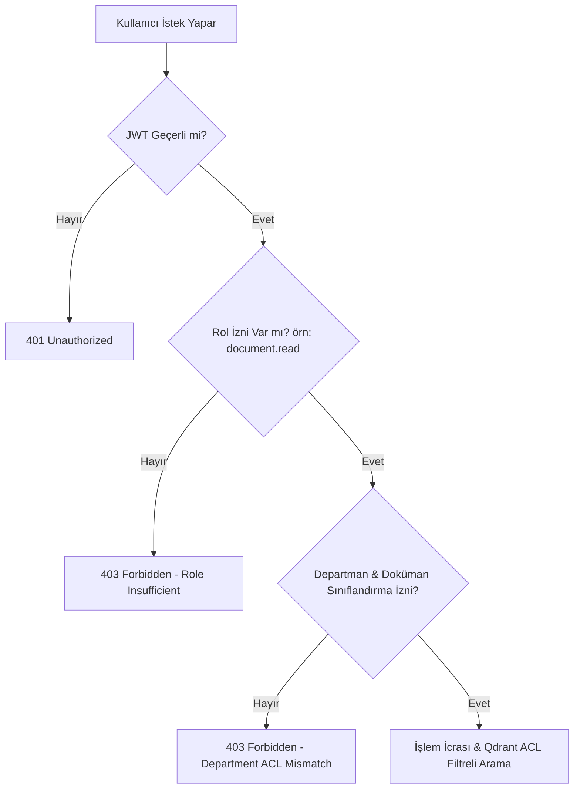

# Selnikel AI — Kurumsal Güvenlik & Yetkilendirme Modeli (SECURITY_MODEL.md)

> **Güvenlik Tezi**: Sıfır Güven (Zero-Trust), Katı ACL İzolasyonu, Tam Denetim İzi (Audit Trail) ve Yerinde Veri Gizliliği (Air-Gapped Privacy).

---

## 1. Kimlik Doğrulama & Kurumsal SSO (Authentication)

- **Protokol**: Microsoft Entra ID (Azure AD) / Kurumsal Active Directory üzerinden OpenID Connect (OIDC) ve OAuth2 Authorization Code Flow with PKCE.
- **Token Formatı**: İmzalı JWT (`RS256`), 15 dakika geçerlilik süresi ve güvenli `HttpOnly; SameSite=Strict; Secure` refresh token mekanizması.
- **Kullanıcı Context'i**: Her API isteğinde JWT çözülür; `user_id`, `department_ids` ve `roles` istek bağlamına (`request.state.user`) enjekte edilir.

---

## 2. Yetkilendirme Mimarisi (RBAC + ABAC Hibrit Model)



### 2.1 Rol Tanımları (RBAC Matrix):
| Rol | Açıklama | İzinler |
| :--- | :--- | :--- |
| **`admin`** | Sistem yöneticisi | Tüm izinler (`*`), kullanıcı yönetimi, audit log inceleme |
| **`approver`** | Başmühendis | `document.approve`, `answer.approve`, `document.read`, `answer.create` |
| **`engineer`** | Ar-Ge / İmalat Mühendisi | `document.upload`, `document.read`, `answer.create`, `export.create` |
| **`service`** | Saha Servis Teknisyeni | `document.read`, `answer.create`, `service_case.create` |
| **`viewer`** | Misafir / Yalnızca Okur | `document.read` (Sadece onaylı dokümanlar) |

### 2.2 Vektör Seviyesinde ACL İzolasyonu (Qdrant Filtering):
Kullanıcı RAG araması yaptığında Qdrant sorgusuna otomatik olarak departman ve sınıflandırma filtresi zorunlu enjekte edilir:

```python
# app/policies/abac.py
from qdrant_client.models import Filter, FieldCondition, MatchAny

def build_qdrant_acl_filter(user: UserContext) -> Filter:
    return Filter(
        must=[
            FieldCondition(
                key="metadata.department_id",
                match=MatchAny(any=user.department_ids)
            ),
            FieldCondition(
                key="metadata.approval_status",
                match=MatchAny(any=["approved"] if "viewer" in user.roles else ["approved", "review"])
            )
        ]
    )
```

---

## 3. Dosya Yükleme & Kötü Amaçlı Yazılım Koruması (Ingestion Security)

1. **MIME & Magic Byte Kontrolü**: Dosya uzantısına güvenilmez; `python-magic` ile ilk 2048 byte taranarak dosyanın gerçek bir PDF, DOCX, XLSX veya TXT olduğu doğrulanır.
2. **Boyut Sınırları**: Tek dosya için maksimum yükleme sınırı **50 MB**'dır.
3. **Malware Tarama**: Yüklenen her dosya `validating` aşamasında ClamAV daemon ve bilinen SHA-256 zararlı imza veritabanından geçirilir.
4. **Güvenli İsimlendirme & Depolama**: Dosyalar doğrudan diskte kullanıcı ismiyle değil, UUID hash'li güvenli depolama yolunda (`storage/{sha256[:2]}/{sha256}.bin`) saklanır.

---

## 4. Dış LLM Veri İletim Politikası (Air-Gapped Data Protection)

Selnikel'in fikri mülkiyeti (patentler, özel brülör yanma odası geometrileri, müşteri gizlilik sözleşmeleri) için katı veri sınıflandırma kuralı uygulanır:

- **`classification: restricted` veya `confidential`**: Yalnızca yerel ağda çalışan **Air-Gapped Yerel LLM (Ollama / vLLM - Qwen2.5-14B)** üzerinden işlenir. Asla harici buluta (OpenAI/Anthropic) gönderilmez.
- **`classification: public_internal`**: Yalnızca anonimleştirilmiş ve onaylanmış teknik veriler opsiyonel bulut modellerine gidebilir.

---

## 5. Denetim İzi, Yedekleme ve Silme Politikası (Audit & Retention)

1. **Audit Trail**: Her doküman okuma, indirme, soru sorma ve onaylama işlemi `audit_events` tablosunda `actor_id`, `request_id`, `ip_hash` ve zaman damgasıyla değiştirilemez (`append-only`) olarak saklanır.
2. **Soft Delete**: Silinen dokümanlar ve revizyonlar fiziksel olarak veritabanından silinmez; `deleted_at` damgası vurularak 90 gün boyunca kurtarılabilir ve denetlenebilir tutulur.
3. **Otomatik Yedekleme**: PostgreSQL ve Qdrant snapshot'ları her gece saat 02:00'de otomatik şifreli (`AES-256`) olarak yedeklenir.
4. **Security Headers**: API yanıtlarında `Strict-Transport-Security`, `X-Content-Type-Options: nosniff`, `X-Frame-Options: DENY`, `Content-Security-Policy` başlıkları zorunludur.
