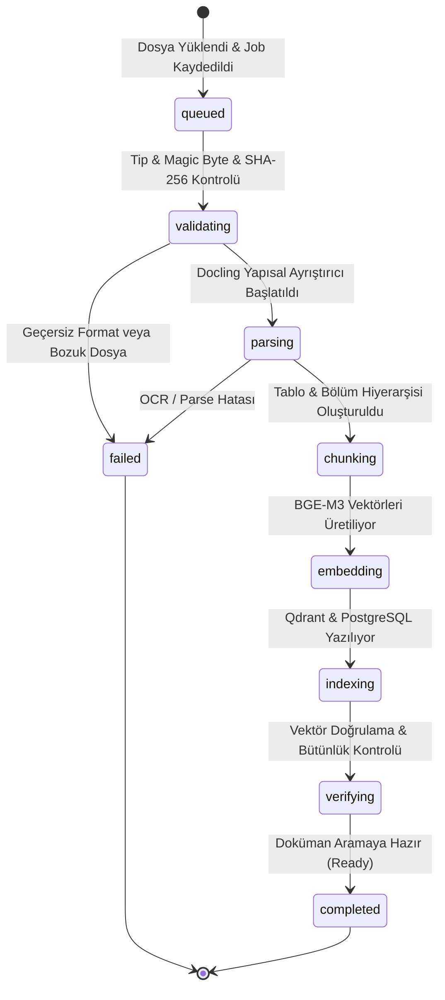
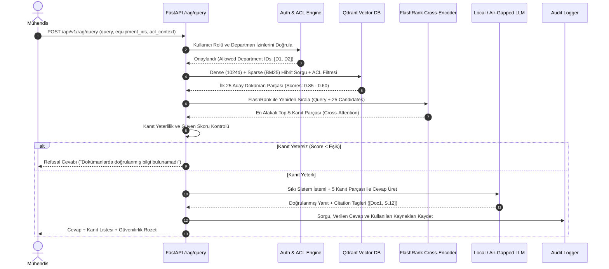

# Selnikel AI — Hedef Mimari Tasarımı (TARGET_ARCHITECTURE.md)

> **Mimari Prensip**: Temiz Katmanlı Mimari (Clean/Hexagonal Architecture), Asenkron İş Kuyruğu (Event-Driven Workers), İzolasyonlu Güvenlik Politikaları ve Ayrık Ön Yüz (Feature-Sliced Design).

---

## 1. Katmanlı Sistem Mimarisi

```text
                               +---------------------------------------------+
                               |              Frontend Katmanı               |
                               |    Next.js 14 / React / TypeScript / FSD    |
                               +----------------------+----------------------+
                                                      | HTTPS / REST & SSE
                               +----------------------v----------------------+
                               |              API Gateway Katmanı            |
                               |  FastAPI / Middleware / Rate Limit / Auth   |
                               +----------------------+----------------------+
                                                      |
                    +---------------------------------+---------------------------------+
                    |                                                                   |
+-------------------v-------------------+                       +-----------------------v-----------------------+
|        Application / Use Cases        |                       |               Worker Katmanı                  |
| - QueryOrchestrator                   |                       | - IngestionWorker (Docling + OCR)             |
| - DocumentRevisionService             |                       | - TableExtractionWorker                       |
| - EquipmentCatalogService             |                       | - VectorIndexWorker (BGE-M3)                  |
| - ServiceCaseMatcher                  |                       | - EvaluationBenchmarkWorker                   |
+-------------------+-------------------+                       +-----------------------+-----------------------+
                    |                                                                   |
+-------------------v-------------------------------------------------------------------v-----------------------+
|                                           Domain Katmanı                                                      |
|  - Varlıklar: User, Role, Equipment, Document, DocumentRevision, DocumentElement, RetrievalChunk, Answer     |
|  - Değer Nesneleri: Sha256Hash, Evidence, Provenance, ACLScope, BoundingBox                                   |
|  - Domain Kuralları: RevisionValidityPolicy, GroundedRefusalPolicy, ConfidenceCalculator                     |
+---------------------------------------------------+-----------------------------------------------------------+
                                                    |
+---------------------------------------------------v-----------------------------------------------------------+
|                                      Infrastructure Katmanı                                                   |
| - PostgreSQL 16 (asyncpg / SQLAlchemy 2.0 / Alembic)    - Qdrant 1.11 (Dense + Sparse Hybrid Storage)         |
| - Local Storage / S3 Adapter (Malware Scanned)          - Local BGE-M3 & FlashRank Reranker Models            |
| - Unified LLM Provider (Air-Gapped Ollama / OpenAI)     - Structured JSON Logger & Audit Trail                |
+---------------------------------------------------------------------------------------------------------------+
```

---

## 2. Modül Dizin Yapısı ve Sorumluluk Sınırları

### 2.1 Backend Dizin Yapısı (`backend/app/`)
```text
backend/app/
├── api/                     # HTTP ve SSE Giriş Kapıları
│   ├── dependencies.py      # Auth, DB Session, ACL Enjeksiyonu
│   ├── v1/
│   │   ├── auth.py          # OIDC / JWT Giriş & Token Doğrulama
│   │   ├── equipment.py     # Ekipman ve Model Katalog Endpoint'leri
│   │   ├── documents.py     # Doküman, Revizyon ve Dosya Endpoint'leri
│   │   ├── ingestion.py     # Ingestion Job durum ve tetikleme
│   │   ├── search.py        # Hibrit Arama & Revizyon Karşılaştırma
│   │   ├── rag.py           # Grounded Soru-Cevap (Sync & SSE Stream)
│   │   ├── service_cases.py # Servis Vakaları ve Arıza Çözümleri
│   │   ├── audit.py         # Güvenlik ve Erişim Denetim Kayıtları
│   │   └── health.py        # Liveness & Readiness Probları
├── application/             # Kullanım Senaryoları (Orchestrators & Services)
│   ├── rag/                 # RAG Arama, Rerank ve Cevap Oluşturma Servisi
│   ├── ingestion/           # Doküman İşleme ve İndeksleme İş Akışları
│   ├── equipment/           # Ekipman Hiyerarşisi ve Model Eşleme
│   ├── revision/            # Revizyon Farkı ve Yürürlük Politikaları
│   └── audit/               # İşlem Loglama ve İzleme Servisleri
├── domain/                  # Saf Domain Modelleri ve İş Kuralları (Sıfır SDK Bağımlılığı)
│   ├── entities/            # Document, Revision, Element, Equipment, User, Answer
│   ├── value_objects/       # ACLScope, Evidence, DocumentType, RevisionStatus
│   └── policies/            # GroundingRules, RefusalRules, AccessControlPolicies
├── infrastructure/          # Veritabanı, Vektör DB ve Harici Servis Adaptörleri
│   ├── db/                  # SQLAlchemy Modelleri, Session ve Migration'lar
│   ├── vector/              # Qdrant Hibrit Vektör Repository
│   ├── parser/              # Docling & OCR Yapısal Çıkarım Adaptörü
│   ├── embedding/           # Local BGE-M3 Dense + Sparse Model Adaptörü
│   ├── reranker/            # Local FlashRank Cross-Encoder Adaptörü
│   ├── llm/                 # Air-Gapped Ollama / OpenAI Adaptörleri
│   └── storage/             # Güvenli Dosya Depolama ve Hash Doğrulama
├── workers/                 # Uzun Süren Asenkron Arka Plan İşleri
│   ├── ingestion_worker.py  # Asenkron Dosya Ayrıştırma & Vektörleştirme
│   └── evaluation_worker.py # Otomatik Benchmark Değerlendirme İşleri
├── policies/                # Güvenlik, ACL ve İzin Matrisi
│   ├── rbac.py              # Rol Bazlı Yetkilendirme Kontrolleri
│   └── abac.py              # Departman & Belge Sınıflandırma Kuralları
└── observability/           # Loglama, Metrikler ve Dağıtık İzleme
    ├── logging.py           # Yapısal JSON Log Formatı
    └── metrics.py           # Prometheus RAG Metrikleri & İstek Süreleri
```

### 2.2 Frontend Dizin Yapısı (`frontend/src/`)
```text
frontend/src/
├── app/                     # Next.js 14 App Router Sayfaları
│   ├── layout.tsx           # Kök Layout (Tema, Auth Provider, Shell)
│   ├── page.tsx             # Ana Çalışma Alanı (İş İstasyonu)
│   ├── equipment/           # Ekipman Kataloğu Sayfası
│   ├── documents/           # Doküman & Revizyon Arşivi
│   ├── service-cases/       # Servis & Arıza Vakaları
│   └── admin/               # Kullanıcı ve Sistem Yönetimi
├── features/                # Kullanıcı İş Akışı Bileşenleri
│   ├── technical-search/    # Hibrit Teknik Arama & Filtreleme
│   ├── grounded-qa/         # Doğrulanabilir RAG Soru-Cevap
│   ├── revision-diff/       # İki Revizyon Arasındaki Değişiklik Karşılaştırması
│   ├── document-viewer/     # Sayfa & Tablo Seviyesinde Belge Görüntüleyici
│   └── service-case-lookup/ # Arıza Kodu ve Vaka Çözüm Arayüzü
├── entities/                # Domain Varlık Görünümleri ve Kartları
│   ├── equipment/           # Kazan/Brülör/Fan Kartları ve Rozetleri
│   ├── document/            # Doküman & Revizyon Etiketleri
│   ├── evidence/            # Kanıt Parçası ve Alıntı Kartı
│   └── user/                # Kullanıcı Profili ve Rol Rozeti
├── widgets/                 # Büyük Birleşik Panel Bileşenleri
│   ├── NavigationSidebar/   # Sol Kurumsal Menü ve Ekipman Ağacı
│   ├── EngineeringWorkspace/# Merkezi Soru-Cevap ve Analiz Tuvali
│   └── EvidenceInspector/   # Sağ Kanıt, Tablo ve Şartname Denetim Paneli
└── shared/                  # Yeniden Kullanılabilir Altyapı
    ├── api/                 # OpenAPI Tabanlı Tip Güvenli API İstemcisi
    ├── ui/                  # Selnikel Design System (Düğmeler, Tablolar, Modal'lar)
    └── lib/                 # Yardımcı Fonksiyonlar ve Formatlayıcılar
```

---

## 3. Asenkron Doküman İşleme Yaşam Döngüsü (Ingestion State Machine)

Uzun süren doküman ayrıştırma ve embedding işlemleri HTTP request yaşam döngüsünden tamamen ayrılmıştır:



### Güvenlik Kontrolleri:
1. **Malware & Magic Byte Doğrulaması**: Dosya uzantısı yerine `python-magic` ile gerçek MIME türü doğrulanır.
2. **SHA-256 Bütünlük Denetimi**: Aynı dosya içeriği yüklendiğinde mükerrer indeksleme engellenir, mevcut revizyon ile eşleştirilir.
3. **Sayfa ve Tablo İzolasyonu**: Tablolar parçalanmaz; yapısal Markdown ve HTML formatında `structured_content` alanında bütünlüğü korunarak saklanır.

---

## 4. İki Aşamalı Hibrit Arama ve Reranking Akışı


